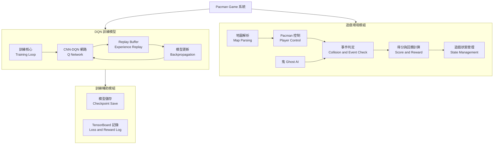
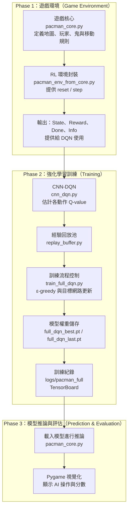

# 專案介紹
使用DQN訓練模型操控pacman，在遊戲中吃豆、閃避鬼取得高分

## 專案功能
使用pygame建立pacman遊戲包含:pacman移動、鬼、牆壁地圖、點數、遊戲結束DQN深度強化學習Agent

## 效能
模型效能CNN DQN，用CNN去處理影像狀態(像素畫面)，並用DQN做強化學習決策遊戲環境效能:pacman環境使用pygame，FPS大約在30~60
訓練效率:300~1000 episodes(局數)，500K~2M steps(步數)

在3分鐘內能躲避鬼並吃完所有的點點

在3分鐘內取得最的分數(吃鬼會加分)
## 介面
外部： 遊戲世界，包含整張地圖、牆壁、點點、能量球、四個鬼、pacman位置

內部：DQN Agent，包含CNN DQN、Agent(更新規則) 
## 驗收
吃完全部的點

# 系統分析 （功能模組與互動流程）
本圖說明 Pacman 強化學習系統中，各功能模組在訓練過程中的互動關係。
遊戲環境模組負責產生狀態與回饋，DQN 訓練模型根據環境狀態進行決策，
並透過經驗回放與反向傳播更新模型參數；訓練輔助模組則負責訓練過程的紀錄與模型儲存。

# 專案架構
本專案將 Pac-Man 強化學習系統依功能劃分為三個主要階段：
遊戲環境、強化學習訓練，以及模型推論與評估。

# API規格表
## 訓練腳本(train_full_dqn.py)
| 項目(epsilon_by_step) | 說明 |  
|:------|:----|
| Function | epsilon_by_step(step, cfg) |
| Method | Pure Function |
| Input | step: int – 目前全域訓練步數 cfg: Config – 超參數設定 |
| Output | eps: float |
| 說明 | 依照訓練步數計算 ε-greedy 的探索率，採用指數衰減，並限制最小值 |

| 項目(main) | 說明 |
|:------|:----|
| Function | Main() |
| Method | Script entry |
| Input | 無 |
| Output | 無 |
| 說明 | 主訓練流程： 初始化環境、模型、Replay Buffer → 執行 DQN 訓練 → 儲存 best / last checkpoint |
## 強化學習環境(pacman_env_from_core.py)
| 項目(`_init_`) | 說明 |
|:------|:----|
| Function | PacmanCoreEnv(max_steps=2000) |
| Method | Constructor |
| Input | max_steps: int – 單一 episode 最大步數 |
| Output | PacmanCoreEnv instance |
| 說明 | 建立一個與 pacman_core.py 同步邏輯的 RL 環境 |

| 項目(resat) | 說明 |
|:------|:----|
| Function | reset() |
| Method | Environment Reset |
| Input | 無 |
| Output | state: np.ndarray (1, H, W) |
| 說明 | 重置遊戲狀態，重新生成地圖、玩家、鬼，並回傳初始 state |

| 項目(_get_state) | 說明 |
|:------|:----|
| Function | _get_state() |
| Method | Internal |
| Input | 無 |
| Output | state: np.ndarray (1, H, W) |
| 說明 | 將目前遊戲狀態轉為 grid 編碼（牆 / 豆 / 玩家 / 鬼）供 CNN 使用 |

| 項目(step) | 說明 |
|:------|:----|
| Function | step(action) |
| Method | Environment Step |
| Input | action: int（0=上, 1=下, 2=左, 3=右） |
| Output | (next_state, reward, done, info) |
| 說明 | 執行一個 frame 的遊戲模擬，包含移動、吃豆、鬼行為、碰撞與終止判定 |

| 項目(render) | 說明 |
|:------|:----|
| Function | render() |
| Method | Optional |
| Input | 無 |
| Output | 無 |
| 說明 | 目前保留空實作，訓練時不渲染畫面 |
## 遊戲核心 API(pacman_core.py)
| 項目(passable) | 說明 |
|:------|:----|
| Function | Passable(r, c) |
| Method | Utility |
| Input | r: int, c: int |
| Output | bool |
| 說明 | 判斷該格是否可通行（牆 / 空白 / 鬼屋） |

| 項目(build_world) | 說明 |
|:------|:----|
| Function | Build_word() |
| Method | World Builder |
| Input | 無 |
| Output | (dots, power, ghost_homes, G_area) |
| 說明 | 依照地圖字元建立豆子、大力丸與鬼屋區域 |
### Grid Mover(Base Class)
| 項目(step) | 說明 |
|:------|:----|
| Function | step() |
| Method | Movement |
| Input | 無 |
| Output | 無 |
| 說明 | 依目前方向與速度移動一格（像素級） |

| 項目(try_turn) | 說明 |
|:------|:----|
| Function | try_turn(dir) |
| Method | Movement |
| Input | dir: (dr, dc) |
| Output | bool |
| 說明 | 嘗試在格點中心轉向，若可行則更新方向 |

| 項目(Ghost.choose_dir) | 說明 |
|:------|:----|
| Function | choose_dir(target, corner, G_area) |
| Method | AI Decision |
| Input | 玩家位置、角落目標、鬼屋區域 |
| Output | 無 |
| 說明 | 根據鬼狀態（chase / scatter / frightened）選擇移動方向 |
## Replay Buffer API（replay_buffer.py）
| 項目(`__init__`) | 說明 |
|:------|:----|
| Function | ReplayBuffer(capacity) |
| Method | Constructor |
| Input | capacity: int |
| Output | ReplayBuffer instance |
| 說明 | 建立固定容量的經驗回放池 |

| 項目(push) | 說明 |
|:------|:----|
| Function | push(s, a, r, ns, d) |
| Method | Data Insert |
| Input | (state, action, reward, next_state, done) |
| Output | 無 |
| 說明 | 將一筆 transition 存入 buffer |

| 項目(sample) | 說明 |
|:------|:----|
| Function | sample(batch_size) |
| Method | Data Fetch |
| Input | batch_size: int |
| Output | (s, a, r, ns, d) |
| 說明 | 隨機抽樣一個 mini-batch 供 DQN 訓練 |

| 項目(`__len__`) | 說明 |
|:------|:----|
| Function | `__len__`() |
| Method | Utility |
| Input | 無 |
| Output | int |
| 說明 | 回傳目前 buffer 中資料筆數 |
# loss function

